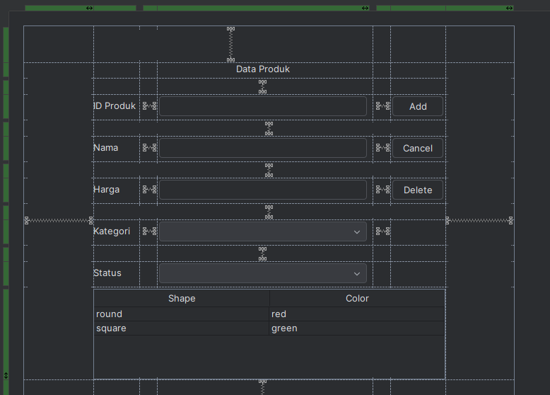
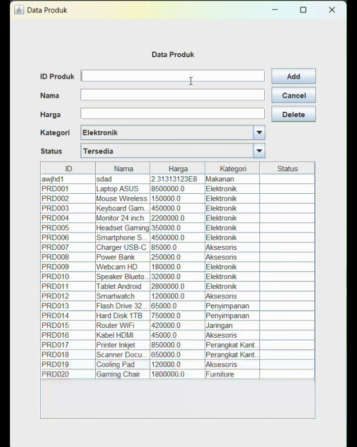

# TP5DPBO2425C2

Java Swing GUI - Database dan Back-End

# Janji

Saya Rafi Ahmad Al Farisi dengan NIM 2409829 mengerjakan Tugas Praktikum 5 dalam mata kuliah Desain dan Pemrograman Berorientasi Objek untuk keberkahanNya maka saya tidak melakukan kecurangan seperti yang telah dispesifikasikan. Aamiin.

### Design GUI

    

# Design Program

Program ini adalah aplikasi CRUD (Create, Read, Update, Delete) berbasis Java Swing GUI yang terhubung ke database MySQL.
Program memungkinkan pengguna untuk: Menambahkan produk baru, melihat semua data produk, mengedit data produk, menghapus data produk

# Penjelasan Alur

### 1. Program dimulai

Kelas ProductMenu dijalankan → JFrame utama ditampilkan. Konstruktor membuat objek Database → otomatis membuka koneksi ke MySQL.

### 2. Data dimuat ke tabel (Load Data)

Program menjalankan query: "SELECT \* FROM product;", hasil ResultSet diubah menjadi DefaultTableModel. Data produk langsung tampil di JTable.

### 3. User menambahkan data (Insert)

User mengisi field ID, Name, Price, Category, Status. Menekan tombol Insert → program validasi input. Jika valid, query dijalankan : "INSERT INTO product (id, name, price, category, status)VALUES (?, ?, ?, ?, ?);". Data langsung muncul di tabel setelah loadTableData() dipanggil ulang.

### 4. User memilih data di tabel

Klik pada baris tabel → field form otomatis terisi data produk tersebut.

### 5. User mengubah data (Update)

User ubah field tertentu, lalu tekan Update. Program jalankan query: "UPDATE product SET name=?, price=?, category=?, status=? WHERE id=?;". Data di database diperbarui tabel otomatis direfresh.

### 6. User menghapus data (Delete)

Klik salah satu baris tabel → tekan Delete. Program tampilkan konfirmasi → jika setuju, jalankan: "DELETE FROM product WHERE id=?;". Tabel direfresh, data hilang dari tampilan.

### 7. User menekan Cancel

Semua field form dikosongkan → siap input baru.

### 8. Program selesai

Saat ditutup, koneksi ke database ditutup otomatis oleh Database.java.

# Dokumentasi

